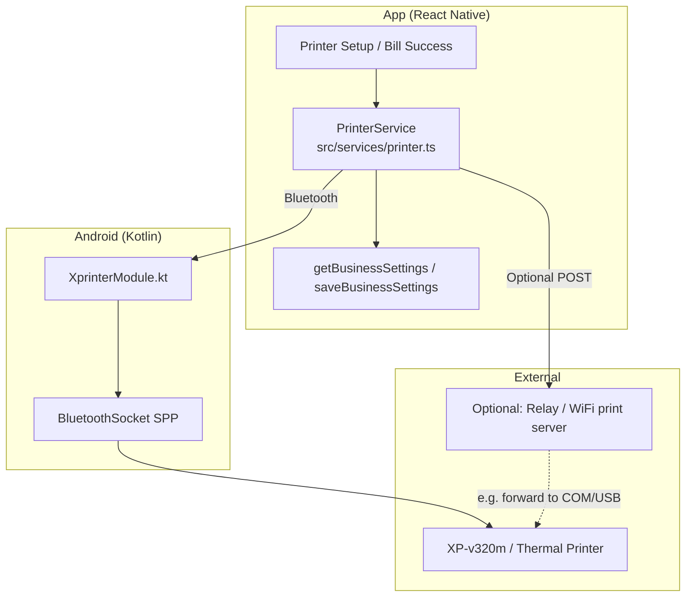
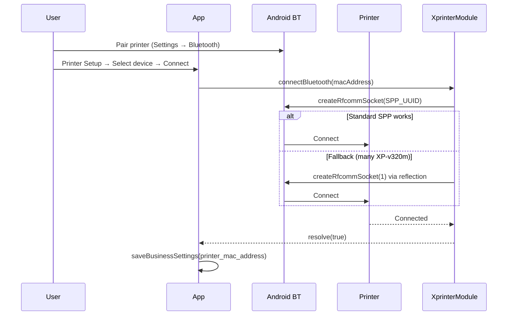
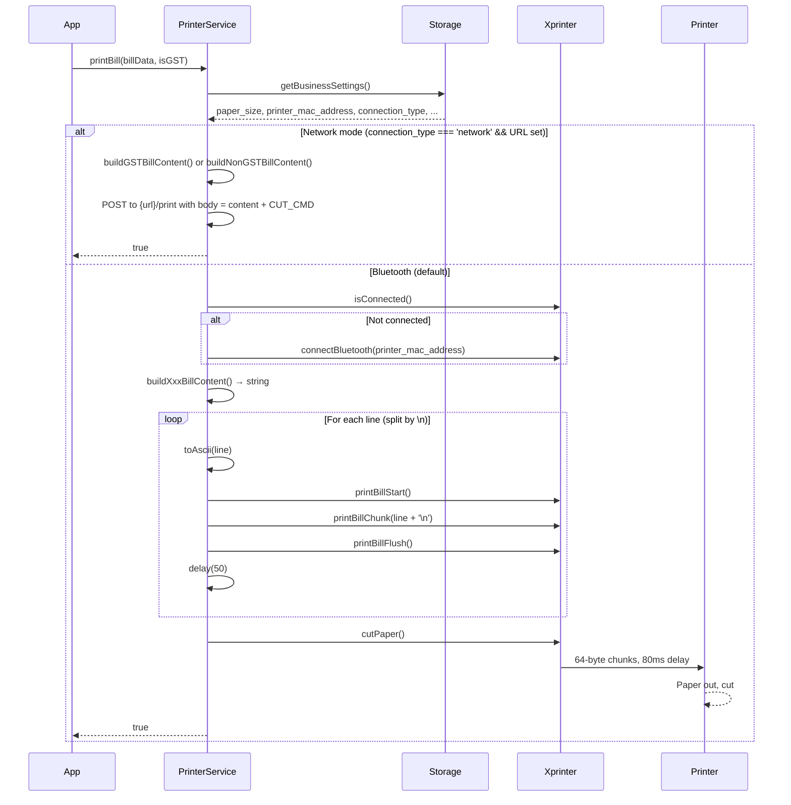

# Ultimate Printer Configuration Guide

**Thermal receipt printing (Bluetooth + optional network)**  
For React Native (Android) with ESC/POS thermal printers (e.g. **XP-v320m**).  
This is the single reference for how printing is implemented, how to configure it, and how to extend it.

---

## Table of contents

1. [Overview](#1-overview)
2. [Architecture](#2-architecture)
3. [Connection flow](#3-connection-flow)
4. [Print bill flow](#4-print-bill-flow)
5. [ESC/POS basics and references](#5-escpos-basics-and-references)
6. [Bluetooth implementation (native)](#6-bluetooth-implementation-native)
7. [Our implementation (JavaScript)](#7-our-implementation-javascript)
8. [Bill layout rules](#8-bill-layout-rules)
9. [Configuration and storage](#9-configuration-and-storage)
10. [Data shapes (GST / Non-GST)](#10-data-shapes-gst--non-gst)
11. [How to implement or extend](#11-how-to-implement-or-extend)
12. [Troubleshooting](#12-troubleshooting)
13. [References and docs](#13-references-and-docs)

---

## 1. Overview

- **Primary path:** The app prints to a **Bluetooth thermal printer** (e.g. XP-v320m). The user pairs the printer in Android Settings, then selects and connects in the app. No server or internet is required.
- **Optional path:** If the user enables **network printing** and sets a **Print server URL**, the same bill content is **POSTed** to that URL (e.g. for emulator relay or WiFi print server). The app does **not** include the relay server; it only sends the bill to the URL you configure.
- **Encoding:** All text sent to the printer is **US-ASCII** (non-ASCII replaced; ₹ → `"Rs "`). Layout is built in JavaScript; the native layer only sends bytes over Bluetooth in small chunks.

---

## 2. Architecture



**Layers:**

| Layer | Role |
|-------|------|
| **UI** | Printer Setup (pair, connect, paper size, network URL), Bill Success (Print Bill), Test Print. |
| **PrinterService** | Builds bill string (ESC/POS + content), decides Bluetooth vs network, sends line-by-line to native or POSTs to URL. |
| **XprinterModule** | Connects to printer via Bluetooth SPP, buffers and flushes data in 64-byte chunks (80 ms delay), cut/cash drawer. |
| **Storage** | `paper_size`, `printer_mac_address`, `printer_connection_type`, `printer_network_url`, etc. |

---

## 3. Connection flow



- **Pairing** is done in **Android system Settings → Bluetooth**; the app only uses **already paired** devices.
- **Connection** is by **MAC address**; the app stores it so it can auto-connect on next print if needed.
- **SPP UUID:** `00001101-0000-1000-8000-00805F9B34FB` (standard Serial Port Profile).

---

## 4. Print bill flow



- **One source of truth:** `buildGSTBillContent()` and `buildNonGSTBillContent()` produce the full bill string; same for Bluetooth (line-by-line send) and network (POST body).
- **Line-by-line** sending avoids the printer dropping the middle of the bill (e.g. items).
- **Cut** is sent after the full bill via `cutPaper()` (ESC/POS full cut).

---

## 5. ESC/POS basics and references

**What is ESC/POS?**  
A command set for thermal receipt printers: **ESC** (0x1B) and **GS** (0x1D) plus parameters control alignment, font size, bold, cut, etc. Printable text is sent as normal bytes (we use ASCII only).

**Commands we use (with examples from our code):**

| Purpose | Command | Hex / our constant | Notes |
|--------|---------|---------------------|--------|
| Initialize | `ESC @` | `0x1B 0x40` | Reset printer. We send at start of every bill. |
| Alignment | `ESC a n` | `0x1B 0x61 n` | n=0 left, 1 center, 2 right. We use left (0) for body; center via space padding, not this. |
| Font size | `ESC ! n` | `0x1B 0x21 n` | n = (width-1) \| ((height-1)<<4). We use 2x2 for store name, then 1x1. |
| Bold | `ESC E n` | `0x1B 0x45 n` | n=1 on, 0 off. |
| Full cut | `GS V m` | `0x1D 0x56 0x01` | We send `\n\n` + GS V 1 after the bill. |

**From our code (`src/services/printer.ts`):**

```ts
const ESC = '\x1B';
const GS = '\x1D';
const CUT_CMD = '\n\n\x1dV\x01';   // Paper cut (used for network only; BT uses cutPaper())

// Examples
leftAlign():   ESC + 'a' + '\x00'
centerText():  ESC + 'a' + '\x01'
setFontSize(2,2): ESC + '!' + String.fromCharCode((2-1) | ((2-1) << 4))  // 0x11
boldOn():      ESC + 'E' + '\x01'
boldOff():     ESC + 'E' + '\x00'
```

**Native cut (`XprinterModule.kt`):**  
`byteArrayOf(0x0a, 0x0a, 0x1d, 0x56, 0x01)` — two newlines then full cut.

**Official references:**  
- [ESC/POS Command Reference (Epson)](https://reference.epson-biz.com/modules/ref_escpos/index.php)  
- Your printer’s manual (e.g. XP-v320m) for any vendor-specific commands.

---

## 6. Bluetooth implementation (native)

**File:** `android/app/src/main/java/com/trenztechnologies/XprinterModule.kt`

**Responsibilities:**

- Use **BluetoothAdapter** to list bonded devices and connect by MAC.
- Connect using **SPP** (`createRfcommSocketToServiceRecord(SPP_UUID)`); on failure, try **reflection fallback** `createRfcommSocket(1)` (required by many Xprinter/XP-v320m).
- Hold one **BluetoothSocket** and **OutputStream**; no concurrent prints.
- **Print API:**  
  - `printBillStart()` — clear buffer.  
  - `printBillChunk(text)` — append string to buffer.  
  - `printBillFlush()` — encode buffer as **US_ASCII**, write to socket in **64-byte chunks** with **80 ms** delay between chunks, then clear buffer.

**Why 64 bytes / 80 ms?**  
To avoid overflowing the printer’s internal buffer (which can cause only the start and end of the bill to print). Chunk size and delay are tunable if needed.

**Encoding:**  
JS sends only ASCII (after `toAscii()`). Native uses `Charsets.US_ASCII` so no encoding issues.

**Other methods:**

- `getPairedDevices()` — list bonded devices (name, address).  
- `connectBluetooth(macAddress)` — connect in background thread.  
- `isConnected()` — true if socket and stream are non-null and connected.  
- `disconnect()` — close stream and socket.  
- `cutPaper()` — send ESC/POS full-cut bytes.  
- `openCashDrawer()` — send ESC/POS cash-drawer command.  
- `printText(text)` — send one string in one go (used rarely; test print now uses line-by-line via PrinterService).  
- `printRawBytes(bytes)` — send raw byte array (e.g. for custom ESC/POS).

---

## 7. Our implementation (JavaScript)

**File:** `src/services/printer.ts`

**Main ideas:**

1. **Single source of truth for content**  
   - `buildGSTBillContent(data, paperWidth)`  
   - `buildNonGSTBillContent(data, paperWidth)`  
   Both return the full bill string (ESC/POS + text). Used for both Bluetooth and network.

2. **Bluetooth send: line-by-line**  
   - `sendToBluetooth(printData)`  
   - Normalize: `toAscii(printData)` (₹ → `"Rs "`, non-ASCII → `'?'`).  
   - Split by `'\n'`. For each non-empty line: `printBillStart()` → `printBillChunk(line + '\n')` → `printBillFlush()` → `delay(50)`.  
   So each line is one flush; the printer sees many small chunks and doesn’t drop the middle.

3. **Store name on its own line**  
   - After `ESC @`, left align, set font size, bold on, we send a **newline**, then the store name (centered by spaces). So the first chunk is ESC-only; the second chunk is the store name with no ESC. That avoids the printer “dropping” the first chunk and missing the name.

4. **First item leading space**  
   - First product name is prefixed with a space (`' ' + item.name`) so if the printer drops the first character of that line, the space is lost and the product name still prints correctly.

5. **Time string**  
   - `timeToAscii(t)` replaces non-ASCII (e.g. Unicode space in "6:09 pm") with a normal space so the receipt doesn’t show `?`.

6. **Network path**  
   - If `printer_connection_type === 'network'` and `printer_network_url` is set, we build the same bill string, append `CUT_CMD`, and POST to `{url}/print` with body = that string. No Bluetooth involved.

**Public API (PrinterService):**

- `getPairedDevices()`  
- `connectBluetooth(macAddress)`  
- `isConnected()`  
- `disconnect()`  
- `printBill(billData, isGST)`  
- `printTestPage()`  
- `openCashDrawer()`  
- `cutPaper()`

---

## 8. Bill layout rules

Layout is **only** in JS (character-based). Paper width drives line length:

- **58 mm** → 32 characters per line.  
- **80 mm** → 48 characters per line.

**GST bill:**

| Section | Style | How |
|--------|--------|-----|
| Header | Centered (space padding) | Store name on own line (font 2x2, bold), then address, GSTIN, FSSAI, phone via `formatCenterLine()`. |
| Separator | Full width | `'-'.repeat(chars)`. |
| Bill details | Label left, value right | Bill No, Date, Invoice No, Table via `formatLabelValueRow()`. |
| Items header | Bold | "Item", "Qty", "Rate", "Amount" with fixed column widths. |
| Items | One row per product, one blank line between | `formatItemRow()`; 80 mm columns: item 18, qty 4, rate 10, amount 12. First item name gets leading space. |
| Totals | Label left, value right | Subtotal, CGST, SGST, Total, Payment Mode, Amount Paid, Change via `formatAmountRow()` / `formatLine()`. |
| Footer | Centered | "GST @x% | ITC Applicable", then footer note (e.g. "Thank You! Visit Again") via `formatCenterLine()`. |

**Non-GST bill:**  
Same idea; no GSTIN/FSSAI in header; items table has Item | Qty | Amount (no Rate column); no CGST/SGST lines; one footer line.

**Centering:**  
We do **not** use ESC/POS center for receipt body; we use **space padding** so the same layout works regardless of printer alignment handling. Store name is on a separate line so its chunk doesn’t start with ESC.

---

## 9. Configuration and storage

**Where:** `business_settings` (SQLite) via `getBusinessSettings()` / `saveBusinessSettings()`.

**Relevant fields:**

| Field | Meaning | Default / note |
|-------|---------|-----------------|
| `paper_size` | `'58mm'` or `'80mm'` | `'80mm'` |
| `printer_mac_address` | Bluetooth MAC of selected printer | Set in Printer Setup after Connect |
| `printer_connection_type` | `'bluetooth'` or `'network'` | `'bluetooth'` |
| `printer_network_url` | Base URL for network print (e.g. `http://10.0.2.2:9101`) | Optional; only used if type is `'network'` |
| `auto_print` | 1 = auto print after bill | 0 |

**UI:**  
`PrinterSetupScreen` — pair/connect Bluetooth, choose paper size, toggle network printing, set Print server URL. All of this reads/writes the above via storage.

---

## 10. Data shapes (GST / Non-GST)

**GST bill** — `GSTBillData` (`src/components/templates/GSTBillTemplate.tsx`):

- Business: `invoiceNumber`, `restaurantName`, `address`, `gstin`, `fssaiLicense`, `phone?`, `logoUri?`
- Bill: `billNumber`, `billDate`, `billTime?`, `tableNumber?`
- Items: `{ name, quantity, rate, amount, gstPercentage? }[]`
- Amounts: `subtotal`, `cgstAmount`, `sgstAmount`, `cgstPercentage`, `sgstPercentage`, `totalAmount`
- Payment: `paymentMode`, `amountPaid?`, `changeAmount?`
- Optional: `footerNote?`, `customerName?`, `customerPhone?`

**Non-GST bill** — `NonGSTBillData` (`src/components/templates/NonGSTBillTemplate.tsx`):

- Same business/bill/items structure; items have `amount`, `rate?` optional.
- Amounts: `subtotal`, `totalAmount` (no CGST/SGST).
- Same payment and optional fields.

The **same** data shapes are used for the on-screen bill template and for `printBill(billData, isGST)`.

---

## 11. How to implement or extend

**Use in another app (no relay):**

1. Ensure the printer is **paired** in Android Bluetooth settings.  
2. Store **paper_size** and **printer_mac_address** (or equivalent config).  
3. On print: connect via your native module (or same XprinterModule) if not connected, then call the same `printBill(billData, isGST)` with data matching `GSTBillData` or `NonGSTBillData`.  
4. No server or relay required; Bluetooth path is standalone.

**Add a new bill type:**

1. Define a data type (e.g. `SimpleBillData`).  
2. Add `buildSimpleBillContent(data, paperWidth)` in `printer.ts` using the same helpers (`formatCenterLine`, `formatLabelValueRow`, `formatAmountRow`, `lineSeparator`, etc.).  
3. Add `printSimpleBill(data, paperWidth)` that calls `sendToBluetooth(buildSimpleBillContent(...))`.  
4. From `printBill()`, branch on bill type and call the right builder + send (or add a new public method).

**Change layout (e.g. columns, header):**

- Edit only the **build** functions in `printer.ts` (`buildGSTBillContent`, `buildNonGSTBillContent`).  
- Column widths are in `getItemColumnWidths()` (GST) and inline constants (Non-GST item columns).  
- No native changes needed.

**Tune Bluetooth behaviour:**

- In `XprinterModule.kt`: `BT_WRITE_CHUNK` (64), `BT_WRITE_DELAY_MS` (80). Increase delay or reduce chunk size if the printer still drops data.  
- In `printer.ts`: `delay(50)` between lines. Increase if needed on slow printers.

---

## 12. Troubleshooting

| Symptom | What to check |
|--------|----------------|
| Store name not printing | Store name must be on its **own line** (newline after bold/size, before name). See “Store name on its own line” in §7. |
| First character of first item missing | First item name is sent with a leading space; if the printer drops one char, the space is lost and the name is correct. If still missing, try increasing line delay or check printer firmware. |
| Time shows as "6:09?pm" | Use `timeToAscii(billTime)` so non-ASCII (e.g. narrow space) becomes a normal space. |
| Only top and bottom of bill print | Send **line-by-line** (Start → Chunk(line) → Flush, delay) instead of one big chunk. Ensure native flush uses **small chunks** (e.g. 64 bytes) and **delay** (e.g. 80 ms). |
| Connection fails on some devices | Use **reflection fallback** `createRfcommSocket(1)` when standard SPP fails (already in XprinterModule). |
| Garbled or random characters | Ensure **US_ASCII** end-to-end: JS `toAscii()` and native `Charsets.US_ASCII`. No UTF-8 or GBK unless the printer explicitly supports it. |
| Cut not happening | Call `cutPaper()` **after** `sendToBluetooth()` finishes. For network, append `CUT_CMD` to the POST body. |

---

## 13. References and docs

- **ESC/POS (Epson):** [ESC/POS Command Reference](https://reference.epson-biz.com/modules/ref_escpos/index.php)  
- **Android Bluetooth:** [Bluetooth overview](https://developer.android.com/guide/topics/connectivity/bluetooth) — SPP, `BluetoothSocket`, `createRfcommSocketToServiceRecord`.  
- **React Native native modules:** [Native Modules (Android)](https://reactnative.dev/docs/native-modules-android) — for extending or reusing XprinterModule.  
- **Project files:**  
  - `src/services/printer.ts` — all bill building and send logic.  
  - `android/app/src/main/java/com/trenztechnologies/XprinterModule.kt` — Bluetooth and flush.  
  - `src/screens/PrinterSetupScreen.tsx` — UI for connection and paper size.  
  - `PRINTER_TESTING_GUIDE.md` — quick test steps (device + optional relay).

---

*This guide is the single source of truth for printer configuration and implementation in this project. For step-by-step testing, see `PRINTER_TESTING_GUIDE.md`.*
